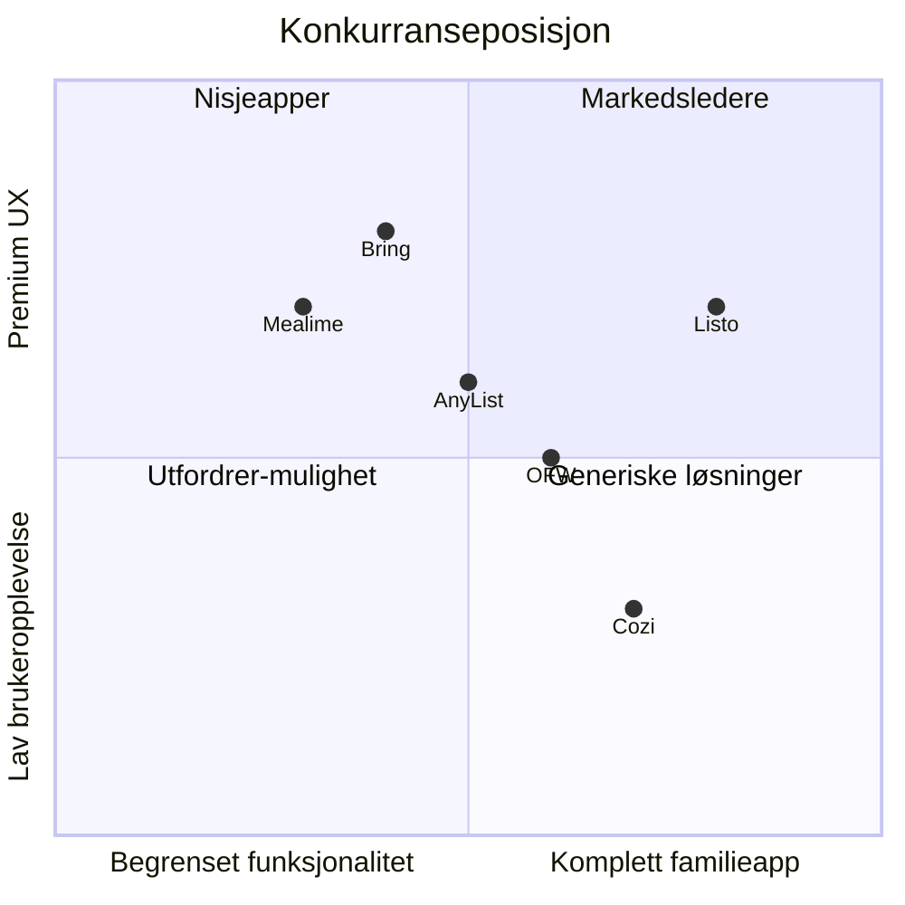

# 🎯 Listo.family Konkurranseanalyse

**Opprettet:** 2. januar 2026  
**Formål:** Kartlegge hovedkonkurrentenes sterkeste sider og definere hvordan Listo kan ta markedsandeler.

---

## Innhold

1. [Executive Summary](#executive-summary)
2. [Hovedkonkurrenter](#hovedkonkurrenter)
3. [Feature-sammenligning](#feature-sammenligning)
4. [Detaljert Konkurranseanalyse](#detaljert-konkurranseanalyse)
5. [Strategiske Anbefalinger](#strategiske-anbefalinger)

---

## Executive Summary

### Konkurranselandskapet

Listo.family opererer i skjæringspunktet mellom **handleliste-apper**, **måltidsplanleggere** og **familie-organisatorer**. Ingen konkurrent dekker alle disse behovene godt, noe som gir Listo en unik posisjon.

**Nøkkelfunn:**
| Kategori | Markedsleder | Listo sin mulighet |
|----------|--------------|-------------------|
| Handlelister | AnyList / Bring! | Live-synk i butikkmodus |
| Måltidsplanlegging | Mealime | Auto-porsjonsjustering etter hvem som er hjemme |
| Familie-organisator | Cozi | Mer moderne UX + ingen paywall-skandale |
| Delt omsorg | OurFamilyWizard | 70% billigere, mindre "juridisk" |

---

## Hovedkonkurrenter

### 1. AnyList 🥇
**Kategori:** Handleliste + Oppskrifter  
**Plattformer:** iOS, Android, Mac, PC, Apple Watch  
**Pris:** Gratis (begrenset) / $9.99/år (Individual) / $14.99/år (Household)

#### Sterkeste Features
| Feature | Styrke | Trussel for Listo |
|---------|--------|------------------|
| **Recipe Import** | Import fra 1000+ nettsider med ett klikk | 🔴 Høy |
| **Meal Planning Calendar** | Drag-and-drop, synk med Google Calendar | 🟡 Middels |
| **Smart Autocomplete** | Foreslår varer basert på historikk | 🟡 Middels |
| **Category Sorting** | Sorterer automatisk etter butikklayout | 🔴 Høy |
| **Siri/Alexa Integration** | Legg til varer med stemme | 🟢 Lav |
| **Price Tracking** | Løpende sum mens du handler | 🟡 Middels |

#### Svakheter
- Ingen samværsplan-funksjonalitet
- Ikke designet for delt omsorg
- Kalender synker ut, men ingen intern familiekalender
- UI føles noe datert

---

### 2. Bring! 🛒
**Kategori:** Handleliste med visuelt fokus  
**Plattformer:** iOS, Android, Apple Watch, Wear OS, Web  
**Pris:** Gratis / Premium (pris ukjent, inkluderer ad-free + temaer)

#### Sterkeste Features
| Feature | Styrke | Trussel for Listo |
|---------|--------|------------------|
| **Visuell UI** | Fargerike ikoner for hver vare | 🔴 Høy |
| **Aktivitetslogg** | Se hvem som la til/fjernet varer | 🟡 Middels |
| **Lojalitetskort-wallet** | Lagre butikk-bonuskort i appen | 🟢 Lav |
| **Priority Labels** | "Haster", "På salg", "Når du vil" | 🟡 Middels |
| **Recipe Import** | Importer ingredienser fra oppskrifter | 🟡 Middels |
| **Multi-platform Sync** | Sanntidssynk på alle enheter | 🟡 Middels |

#### Svakheter
- Ingen måltidsplanlegger
- Ingen familiekalender
- Fokuserer kun på shopping, ikke familielogistikk
- Ingen samværsplan

---

### 3. Cozi Family Organizer 👨‍👩‍👧
**Kategori:** Familie-hub  
**Plattformer:** iOS, Android, Web  
**Pris:** Gratis / Cozi Gold $39/år

#### Sterkeste Features
| Feature | Styrke | Trussel for Listo |
|---------|--------|------------------|
| **Familiekalender** | Delt kalender for opptil 12 medlemmer | 🔴 Høy |
| **Huskelister** | Handlelister + to-do lister | 🟡 Middels |
| **Måltidsplanlegger** | Enkel ukesplan | 🟡 Middels |
| **Chore Charts** | Oppgavefordeling for barn | 🟡 Middels |
| **Markedsføring** | Mest kjente merkevare i kategorien | 🔴 Høy |

#### Svakheter 🚨 **STOR MULIGHET**
- **Paywall-skandale mai 2024:** Plutselig begrenset gratis kalender til 30 dager uten varsel
- **Trustpilot 2.1/5** - Massiv brukermisnøye
- Ingen AI-funksjoner
- Ingen samværsplan for delt omsorg
- Ingen live-synk i butikkmodus
- UI føles utdatert

> [!IMPORTANT]
> Cozis omdømmekrise er Listos største mulighet. Mange søker aktivt etter alternativer.

---

### 4. OurGroceries 📋
**Kategori:** Enkel handleliste  
**Plattformer:** iOS, Android, Web, Alexa, Google Home  
**Pris:** Gratis / Premium $20 (livstid)

#### Sterkeste Features
| Feature | Styrke | Trussel for Listo |
|---------|--------|------------------|
| **Enkelhet** | Minimalistisk, lett å forstå | 🟡 Middels |
| **Livstidspris** | $20 én gang, ingen abonnement | 🔴 Høy |
| **Barcode Scanning** | Legg til varer med strekkode | 🟡 Middels |
| **Photo Attachments** | Legg til bilde av produkt | 🟢 Lav |
| **Recipe Integration** | Lagre oppskrifter, legg til ingredienser | 🟡 Middels |

#### Svakheter
- Ingen måltidsplanlegger
- Ingen familiekalender
- Ingen samværsplan
- Begrenset til shopping

---

### 5. Mealime 🍽️
**Kategori:** Måltidsplanlegger  
**Plattformer:** iOS, Android  
**Pris:** Gratis / Pro $2.99/mnd (~$36/år)

#### Sterkeste Features
| Feature | Styrke | Trussel for Listo |
|---------|--------|------------------|
| **Personalisering** | 200+ tilpasningsalternativer (allergier, diett) | 🔴 Høy |
| **Raske oppskrifter** | Fokus på <30 min måltider | 🔴 Høy |
| **Auto-handleliste** | Genererer liste fra ukesplan | 🟡 Middels |
| **Butikk-organisering** | Sortert etter gangtype | 🟡 Middels |
| **Kalorier/Næring** | Detaljert næringsinnhold | 🟡 Middels |

#### Svakheter
- Kun måltider - ingen familielogistikk
- Ingen kalender
- Ingen samværsplan
- Verst i klassen på familiedeling

---

### 6. OurFamilyWizard 👨‍👧
**Kategori:** Co-parenting / Delt omsorg  
**Plattformer:** iOS, Android, Web  
**Pris:** $150-300/år

#### Sterkeste Features
| Feature | Styrke | Trussel for Listo |
|---------|--------|------------------|
| **Samværskalender** | Detaljert plan for hvem som har barna | 🔴 Høy |
| **Rettslig anerkjent** | Brukes i rettssaker | 🟡 Middels |
| **Expense Tracking** | Deler barnerelaterte utgifter | 🟡 Middels |
| **1M+ brukere** | Etablert markedsposisjon | 🟡 Middels |

#### Svakheter 🚨 **STOR MULIGHET**
- **Dyrt:** $150-300/år vs Listo 689 NOK (~$65)
- Føles "juridisk" og kaldt
- Ingen måltidsplanlegging
- Ingen handlelister
- Overwhemling for vanlige familier

---

### 7. Honeydew Family App 🍯
**Kategori:** Ny familie-app  
**Plattformer:** iOS, Android  
**Pris:** Freemium

#### Sterkeste Features
| Feature | Styrke | Trussel for Listo |
|---------|--------|------------------|
| **AI-kategorisering** | Auto-sorterer handleliste-varer | 🟡 Middels |
| **Voice Input** | Legg til med stemme | 🟢 Lav |
| **Integrert kalender** | Kalender + lister i én | 🟡 Middels |

#### Svakheter
- Relativt ny, lite etablert
- Begrenset oppskrifts-funksjonalitet
- Ingen samværsplan

---

## Feature-sammenligning

| Feature | Listo | AnyList | Bring! | Cozi | OurGroceries | Mealime | OFW |
|---------|:-----:|:-------:|:------:|:----:|:------------:|:-------:|:---:|
| **Live-synk butikkmodus** | ✅ | ❌ | ❌ | ❌ | ❌ | ❌ | ❌ |
| **Auto-handleliste fra plan** | ✅ | ✅ | ❌ | ❌ | ❌ | ✅ | ❌ |
| **Porsjonsjustering** | ✅ | ❌ | ❌ | ❌ | ❌ | ❌ | ❌ |
| **Samværsplan** | ✅ | ❌ | ❌ | ❌ | ❌ | ❌ | ✅ |
| **Steder (hytte/båt)** | ✅ | ❌ | ❌ | ❌ | ❌ | ❌ | ❌ |
| **Familiekalender** | ✅ | ❌ | ❌ | ✅ | ❌ | ❌ | ✅ |
| **Recipe Import** | ⚠️ | ✅ | ✅ | ❌ | ⚠️ | ❌ | ❌ |
| **AI-assistanse** | ✅ | ❌ | ❌ | ❌ | ❌ | ❌ | ❌ |
| **UX/Design** | 🟢 | 🟡 | 🟢 | 🔴 | 🟡 | 🟢 | 🟡 |

**Legende:** ✅ Har | ⚠️ Delvis | ❌ Mangler | 🟢 God | 🟡 OK | 🔴 Dårlig

---

## Strategiske Anbefalinger

### 1. Utnytt Cozis Krise 🎯

**Mulighet:** Cozi har Trustpilot 2.1/5 etter paywall-skandalen. Brukere søker aktivt alternativer.

**Tiltak:**
| Handling | Prioritet | Frist |
|----------|-----------|-------|
| SEO-optimalisert bloggpost: "Beste Cozi-alternativ 2026" | 🔴 Kritisk | Uke 2 |
| Redirect-kampanje mot "cozi alternative" søk | 🔴 Kritisk | Uke 3 |
| Feature-sammenligning på landing page | 🟡 Høy | Uke 4 |
| Transparent kommunikasjon om prisendringer | 🟢 Normal | Løpende |

---

### 2. Differensier på Live-synk 🛒

**Listo sin unike styrke:** To personer kan handle samtidig med sanntidsoppdatering.

**Tiltak:**
| Handling | Prioritet | Frist |
|----------|-----------|-------|
| Produser demo-video av butikkmodus | 🔴 Kritisk | Uke 2 |
| "Parhandling"-feature som hero på landing | 🟡 Høy | Uke 3 |
| Testimonials fra familier som handler sammen | 🟡 Høy | Uke 6 |

---

### 3. Ta Markedsandeler fra OurFamilyWizard 💰

**Mulighet:** OFW koster $150-300/år og føles "juridisk". Listo er 70% billigere og varmere.

**Tiltak:**
| Handling | Prioritet | Frist |
|----------|-----------|-------|
| Pris-sammenligning på samværsplan-side | 🔴 Kritisk | Uke 3 |
| "For vanlige familier, ikke rettssalen" messaging | 🟡 Høy | Uke 4 |
| Bloggpost: "Delt omsorg uten stress" | 🟡 Høy | Uke 5 |
| Partnerskap med familierådgivere/psykologer | 🟢 Normal | Q2 |

---

### 4. Forbedre Recipe Import 📖

**Gap:** AnyList har best-in-class recipe import. Listo må ta igjen.

**Tiltak:**
| Handling | Prioritet | Frist |
|----------|-----------|-------|
| Forbedre OCR for kokebøker (allerede har) | 🟡 Høy | Uke 4 |
| Støtte URL-import fra populære oppskriftssider | 🔴 Kritisk | Uke 6 |
| Browser extension for oppskriftsimport | 🟢 Normal | Q2 |

---

### 5. Visualiser Handlelisten Bedre 🎨

**Gap:** Bring! har visuelt tiltalende ikoner. Listo har tekst-basert liste.

**Tiltak:**
| Handling | Prioritet | Frist |
|----------|-----------|-------|
| Kategori-ikoner i handlelisten | 🟡 Høy | Uke 5 |
| Valgfri "ikon-modus" som Bring! | 🟢 Normal | Uke 8 |
| Fargekoding per kategori | 🟢 Normal | Uke 6 |

---

### 6. Konkurransefortrinn å Bevare ✨

Disse features har ingen konkurrenter:

| Feature | Beskyttelse | Anbefaling |
|---------|-------------|------------|
| **Live-synk butikkmodus** | Høy teknisk kompleksitet | Markedsfør aggressivt |
| **Auto-porsjonsjustering** | Unik datamodell | Highlight i onboarding |
| **Steder (hytte/båt)** | Nisjebehov | Målrett hyttefamilier |
| **Alt-i-ett** | Bred produktvisjon | Posisjon som "1 app, ikke 5" |

---

## Prissammenligning

| App | Gratis | Premium |
|-----|--------|---------|
| **Listo** | 14 dager full, deretter begrenset | 689 NOK/år (~$65) |
| AnyList | 5 web-oppskrifter, basisfunksjoner | $9.99-14.99/år |
| Bring! | Full med annonser | Ukjent |
| Cozi | 30 dagers kalender (etter skandale) | $39/år |
| OurGroceries | Full med annonser | $20 (livstid) |
| Mealime | Begrenset oppskrifter | $36/år |
| OurFamilyWizard | Ingen | $150-300/år |

> [!TIP]
> Listos pris på 689 NOK/år ligger mellom budget-apper og premium co-parenting-løsninger. Posisjonér som "premium familieapp til en fair pris".

---

## Oppsummering

### Listos Konkurranseposisjon

### Topp 3 Strategiske Prioriteringer

1. **🎯 Utnytt Cozi-krisen** - SEO + sammenligning + transparent kommunikasjon
2. **🛒 Markedsfør live-synk** - Demo-video + hero feature posisjonering
3. **💰 Ta OFW-kunder** - Prisfordel + varmere posisjonering

---

*Sist oppdatert: 2. januar 2026*
